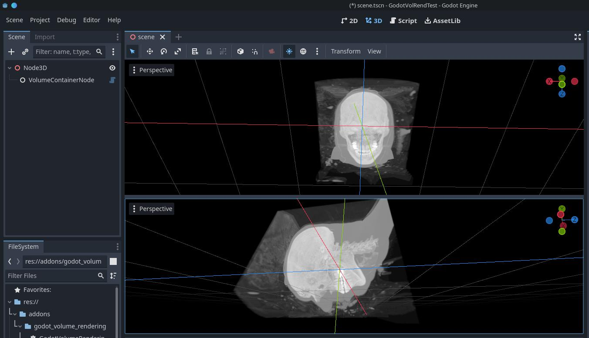

# Godot Volume Rendering

Volume rendering of 3D volumetric datasets, implemented in Godot.

**NOTE: WORK IN PROGRESS**

This is (the beginning of) a Godot-port of the [volume rendering plugin for Unity](https://github.com/mlavik1/UnityVolumeRendering) that I have been developing for some time.
I am hoping to find time to port over all features the Unity plugin has.

**Please let me know if you are interested in using this**, since it's nice for me to know whether or not there's a need for this project - and I'm happy to adjust my priorities based on requests.
I've seen a lot of people using my Unity plugin, but with Godot becoming more stable, feature-rich and well-documented, I think Godot can become a better alternative for many of my users,

## Why use Godot over Unity?

- Godot is 100% free (no fees or paid licenses!)
- Godot is open source, and can easily be customised

## Features
- [x] Direct volume rendering, using 1D transfer functions
- [x] Maximum intensity projection
- [x] Loading of RAW datasets

## Features to be ported over from the Unity-plugin
- [ ] Isosurface rendering
- [ ] Lighting
- [ ] Transfer function editor
- [ ] Saving/loading transfer functions
- [ ] Cutout/clipping tools
- [ ] Cubic sampling
- [ ] Support for more file formats:
    - [ ] DICOM support
    - [ ] NRRD support
    - [ ] NIFTII support

Please let me know if there are any of these features you'd like me to prioritise.

## How to use

Add a VolumeContainerNode to your scene, select it and click "Import dataset" in its inspector.

From there you can select a raw dataset to import, and specify how it should be imported.

Support for more dataset formats are coming soon!

## How to contribute

Contributions are very welcome! You can either:
- Create issues, to report bugs or make suggestions.
- Create pull requests

If you wish to contribute with code, maybe you could help out porting over features from [my Unity Volume Rendering plugin](https://github.com/mlavik1/UnityVolumeRendering)?

See the list above for things that still need to be ported over to the Godot plugin.

